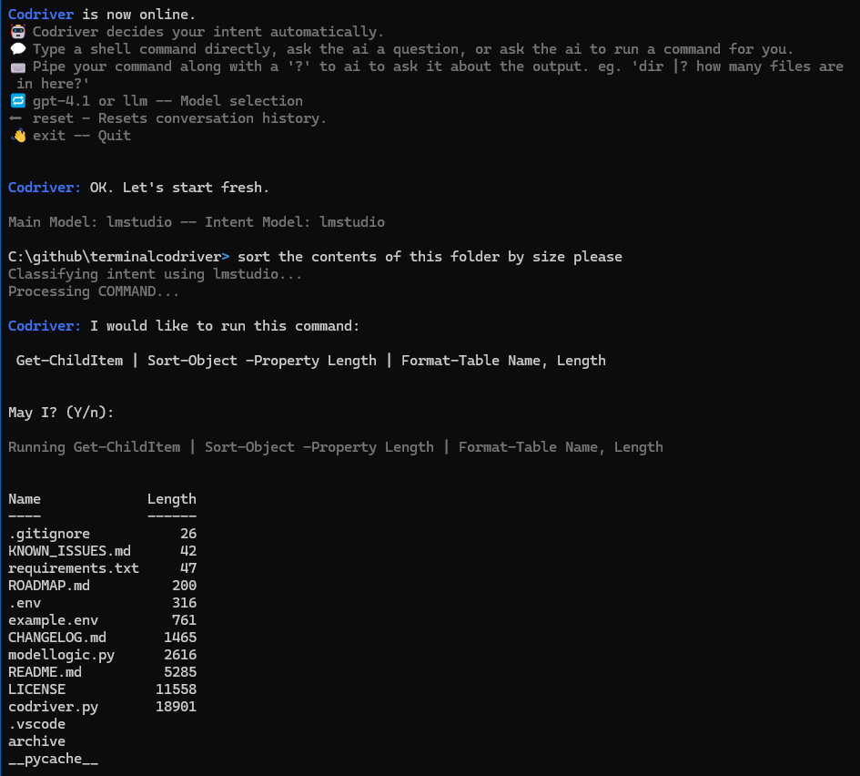

# TerminalCodriver

## Your AI-Powered Command Line Companion

Work in powershell or bash with a codriver at your side.
Auto-intent discovery allows you to just type either commands or questions or requests of the ai and it will handle it.
Treat it like a normal terminal, but ask for ai help when you want.



## Features

💬 Type a shell command directly, ask the ai a question, or ask the ai to run a command for you. Intent is discovered in real time.

⌨️ Pipe your command along with a '?' to ai to ask it about the output. eg. 'dir |? how many files are in here?'

🗃️ Add file(s) to your conversation context with @, eg. '@mycode.ps1 @mynotes.txt' 

💾 Save the last AI response with save, eg. 'save mycode.py'

🔁 gpt-4.1 or llm -- Model selection

⬅️ reset - Resets conversation history.

👋 exit -- Quit

## Installation

To get started with TerminalCodriver, follow these steps:

1.  **Clone the repository:**
    ```bash
    git clone https://github.com/stavrostzagadouris/TerminalCodriver.git
    ```
2.  **Navigate to the project directory:**
    ```bash
    cd TerminalCodriver
    ```
3.  **Install dependencies:**
    Make sure you have Python installed on your system. Then, install required libraries using pip:
    ```bash
    pip install -r requirements.txt
    ```

## Configuration (.env file)

Create a `.env` file in the root of your project directory based on the `example.env` file. At a minimum, you need to provide your OpenAI API key.

```
# example.env content
OPEN_AI_KEY="your_openai_api_key_here"

# Optional: For LM Studio integration
# lmstudioIP="127.0.0.1"
# lmstudioPort="1234"
# lmstudioModel="your-lm-studio-model-name"

# Optional: Default model to use at startup
# defaultModel="gpt-4.1"

# Optional: Model for classifying user intent (e.g., a smaller, faster model)
# classifyingModel="gpt-4.1-nano"
```

**Key variables:**

*   `OPEN_AI_KEY`: Your API key for OpenAI services.
*   `lmstudioIP`: (Optional) The IP address where your LM Studio instance is running.
*   `lmstudioPort`: (Optional) The port your LM Studio instance is listening on.
*   `lmstudioModel`: (Optional) The name of the model loaded in your LM Studio instance. Cosmetic only, not actually used
*   `defaultModel`: (Optional) Specifies the AI model to use by default when the Codriver starts.
*   `classifyingModel`: (Optional) A dedicated model for classifying user input intent (e.g., `gpt-4.1-nano` for faster classification).

## Usage

To run TerminalCodriver, simply execute the following command in your terminal:

```bash
python codriver.py
```

Once running, you can interact with the Codriver in several ways:

### Running Shell Commands

Type any standard shell command, and the Codriver will execute it directly:

```bash
ls -l
```

### Chatting with AI

Ask the Codriver a question, and it will provide an answer:

```bash
how do I list all running processes on Linux?
```

### Auto Command Execution

Tell the Codriver what you want to achieve, and it will suggest and run the appropriate command (after your confirmation):

```bash
tell me how much space is left on my C drive
```
The Codriver will respond:
```
Codriver: I would like to run this command:

 Get-PSDrive C:

May I? y/n
```
If you type `y` and press Enter, the command will be executed.

### Piping Command Output to AI

Analyze the output of a command or ask a follow-up question based on it using the `|?` syntax:

```bash
dir |? how many files are in here?
```
The Codriver will run `dir`, capture its output, and then send both the command and its output to the AI along with your question. If the initial command fails, the AI will attempt to suggest a fix.

### Switching AI Models

*   To use the OpenAI `gpt-4.1` model:
    ```bash
    gpt-4.1
    ```
*   To connect to your local LM Studio instance:
    ```bash
    llm
    ```

### Resetting Conversation History

To clear the current conversation context:

```bash
reset
```

## License

This project is licensed under the [MIT License](LICENSE).

## Contributing

Contributions are welcome! Please feel free to submit pull requests or open issues.
